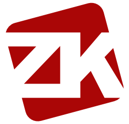

# ZK Playground

ZK Playground is an easy-to-use visual IDE for exploring the Zokrates language and ZK-Snarks.

ZK Playground uses [ZoKrates toolbox](https://github.com/Zokrates/ZoKrates).

## Features
 

 
- Zokrates syntax highlighting 
- Auto-completion
- Auto-linting 
- Auto-parsing of main arguments
- One-click compile and proof generation

Soon:

- Templates
- Export to and deploy on [Composite](https://github.com/compositeapp/Composite/releases)

## What is Zokrates?

Zokrates is an experimental language and toolbox for zk-SNARK-based smart contracts, funded by the Ethereum Foundation.

When a Zokrates smart contract is executed, Zokrates produces the new result (the new state) plus a proof that the computation was run correctly. This enables smart contracts to be run only once on a single computer (as opposed to every single mining node in the network), which greatly improves blockchain scaling.

Zokrates also supports privacy. Inputs (arguments) can be set to private. Private inputs will not be known to the verifiers, yet the verifiers can easily verify that correctness of the output, even without knowing the inputs.

Zokrates is experimental and not suitable for production. Alternatives to Zokrates include [ZEXE](https://github.com/scipr-lab/zexe) and Coda Protocol's Snarky (no public repo available yet).

## Why ZK Playground?

Zero knowledge proofs will likely revolutionize blockchain. ZK Playground was created to make zk-SNARKs accessible to as many developers as possible. Understanding the concepts behind zk-SNARKs (even without the mathematics) could be extremely valuable as more blockchains use zero knowledge proofs.

## What are zk-SNARKs?

zk-SNARKs are a new and fascinating form of cryptography. Zk-SNARKS are a way to prove honest computation: an application (the verifier) can verify that another computer (the prover) ran a computation correctly, without having to rerun the computation itself, or even having to know the inputs used to run the computation.

The prover produces the output (e.g., a new blockchain state) plus a small proof (less that half a kilobyte) that proves that the prover ran the computation correctly. A blockchain node can then cheaply verify the correctness, even if the node does not know the inputs. Verification is cheap. In a way, proof verification is similar to how a node now  instantly verifies a Proof of Work block hash is correct.

Zk-SNARKs could potentially solve three big challenges blockchains face today: 

- **Privacy**: Inputs can be set to private and don't have to be known by the verifier. This property is used by coins like Zcash.
- **Scaling**: Instead of having every blockchain node running the same scripts, only one (off-chain) node needs to run the smart contract.
- **Centralization**: By generating proof of verification of the blockchain, a tiny, fixed sized blockchain becomes possible. Unlike traditional blockchains (which can be gigabytes in size), any small computer or even phone is able to verify the blockchain state. [Coda](https://codaprotocol.com/testnet.html) uses zk-SNARKs to compress the blockchain to 20 kilobytes.

ZK-Snarks are currently used by [Zcash](https://z.cash), [Coda](https://codaprotocol.com), [ZEXE](https://github.com/scipr-lab/zexe) and [0x](https://0x.org).

Alternatives to zk-SNARKs include zk-STARKs (with a T) and Bulletproofs (useful for range proofs).

## Download
Download latest version in [releases section](https://github.com/compositeapp/ZKPlayground/releases).

## Requirements
- MacOS 10.13 or higher
- Docker ([download](https://docs.docker.com/docker-for-mac/install))

## Zokrates Resources
- [Zokrates documentation](https://zokrates.github.io)
- [Zero Knowledge Podcast Episode 41: Zokrates with Jacob Eberhardt](https://www.zeroknowledge.fm/41)
- [Video: ZoKrates - a zkSNARK toolbox](https://www.youtube.com/watch?v=_QyXreu64kQ)
- [Video: Elena Nadolinski's demo at Dystopia Labs](https://medium.com/dystopia-labs/dystopia-labs-meetup-1-demystifying-zero-knowledge-proofs-how-to-build-a-dapp-using-zk-snarks-3e8529812a44)
- [How I learned ZK-snarks from scratch](https://medium.com/@weijiek/how-i-learned-zk-snarks-from-scratch-177a01c5514e)

## zk-SNARK Resources
- [Zcash: What are zk-SNARKs?](https://z.cash/technology/zksnarks/)
- [Ethereum: zkSNARKs in a nutshell](https://blog.ethereum.org/2016/12/05/zksnarks-in-a-nutshell/)
- [SNARKs and their practical applications](https://www.youtube.com/watch?v=Rm-p8rrR9c8)
- [0x roadmap](https://youtu.be/qh2S9J4CI-0) (Warning: Funky Zeit Musik)

## Notes

ZK Playground was created in two weeks as part of the first [Insight Distributed Consensus](https://www.insightconsensus.com) program in March-April 2019. 

